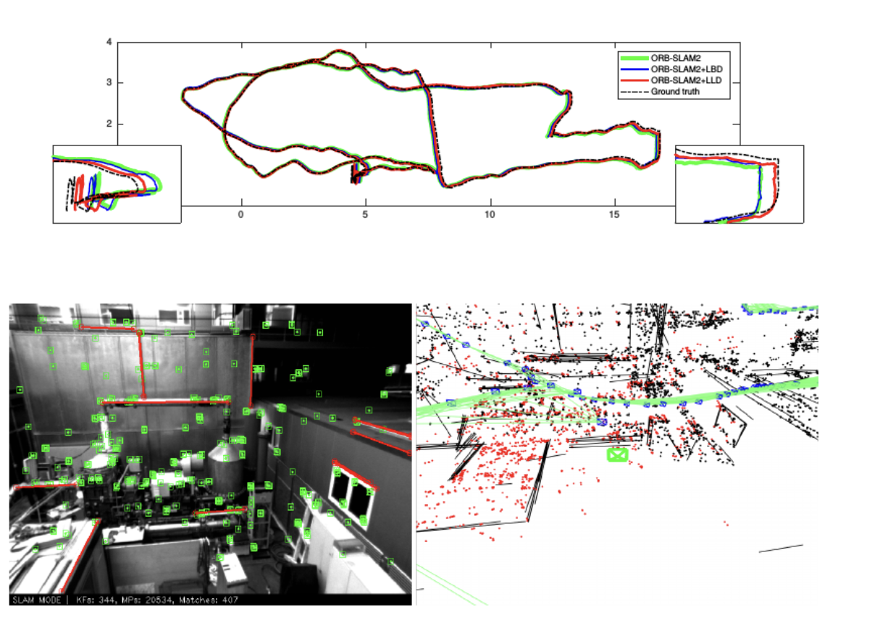
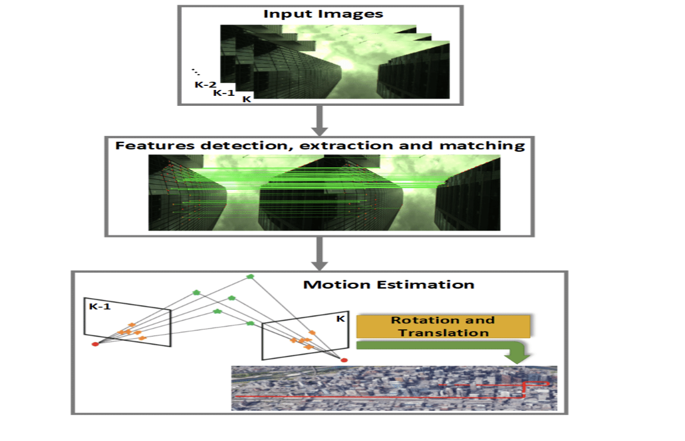
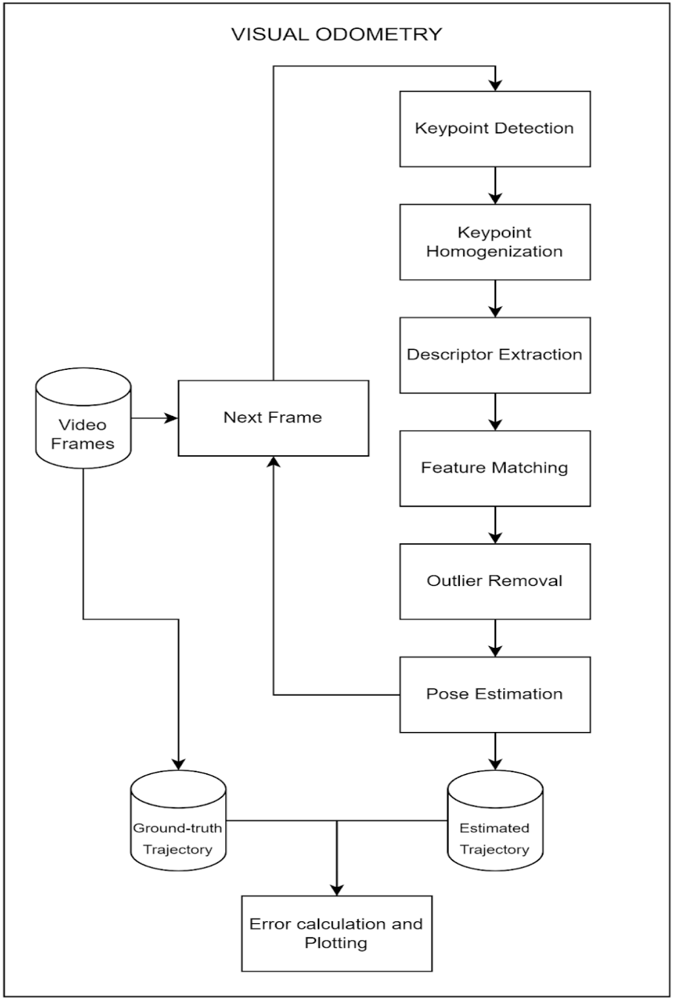

# visual-odometry
Small scale replication of my work at NTU SIngapore

# Visual Simultaneous Localization And Mapping (VSLAM)

SLAM is the set of algorithms that allows an autonomous moving object to know two things:

1. Where am I? - It’s about localization.
2. What is the surrounding environment like? - It’s about map building.

Localization and map building can be seen as the perception in both inward
and outward directions. A completely autonomous robot needs to
understand its own state (i.e., the location) and the external environment (i.e., the
map).

VSLAM uses cameras for the SLAM task allowing it to be more flexible than systems based on lasers, GPS, guiding rails, etc.

A typical visual SLAM workflow includes the following steps:

1. Sensor data acquisition - In visual SLAM, this mainly refers to for acquisition and preprocessing of camera images
2. Visual Odometry (VO) - VO’s task is to estimate the camera movement between adjacent frames (ego-motion) and generate a rough local map. VO is also known as the frontend of VSLAM
3. Backend filtering/optimization - The backend receives camera poses at different time stamps from VO and results from loop closing, and then applies optimization to generate a fully optimized trajectory and map. Because it is connected after the VO, it is also known as the backend.
4. Loop Closing - Loop closing determines whether the robot has returned to its previous position in order to reduce the accumulated drift. If a loop is detected, it will provide information to the backend for further optimization.
5. Reconstruction - It constructs a task-specific map based on the estimated cam-
era trajectory.

My internship task focused on the VO part of VSLAM.

# Visual Odometry (VO) 

VO is the frontend of VSLAM.
VO’s task is to estimate the camera movement between adjacent frames (ego-motion)  of the input video feed and generate a rough local map for optimization by the backend.

Visual odometry (in the simplest case) only estimates the movement between two frames. We know that each estimate is accompanied by a certain error. Because of the way odometry works, errors from previous moments will be carried forward to the next moments. The accumulated drift will make us unable to build a consistent map. This optimization is the work of the backend.

VO pipeline -

1. Keypoint detection - Detects distinct points of interest in the video frame. The key point refers to the 2D position of a feature point. Some types of key points also hold other information, such as the orientation and size.

2. Homogenization - Used to ensure uniform/homogeneous distribution of feature points in the image.

3. Descriptor generation - The descriptor is usually a vector, describing the information of the pixels around the keypoint. The descriptor should be designed according to the principle that features with similar appearance should have similar descriptors. Therefore, as long as the two features’ descriptors are close in vector space, they can be considered the same feature.

4. Feature matching - Determine the correspondence between the current feature points and the feature points seen before (adjacent frames) by using some distance metric (Hamming Distance, Euclidean distance) to indicate the degree of similarity of two features.

5. Outlier Rejection - Remove outliers from feature matches for more robust pose estimation.

6. Pose Estimation - Calculating the camera motion and thus the camera pose.

# SYSTEN DESIGN
